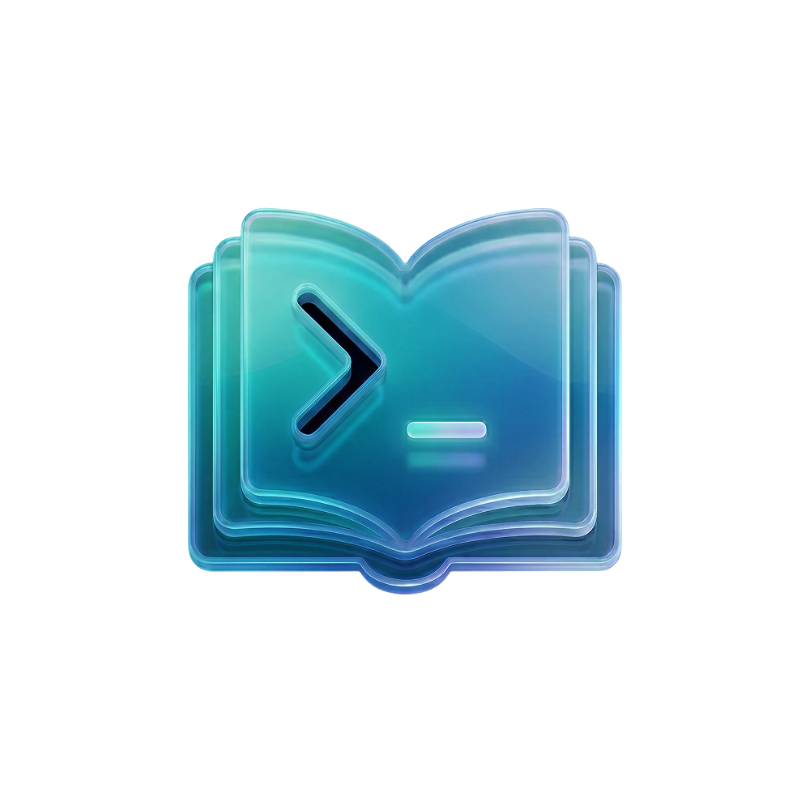

# moodle-cli



CLI and JSON API for FHGR Moodle.
Use it to log in, list courses and files, or run a local API server.

## Quick setup

### Use as CLI

1. Install `moodle`.

macOS / Linux:
```sh
curl -fsSL https://raw.githubusercontent.com/DotNaos/moodle-cli/main/scripts/install.sh | bash
```

Windows PowerShell:
```powershell
irm https://raw.githubusercontent.com/DotNaos/moodle-cli/main/scripts/install.ps1 | iex
```

2. Save your login once.

```sh
moodle config set \
  --school fhgr \
  --username "<username>" \
  --password "<password>"
```

3. Log in.

```sh
moodle login
```

You should see `session saved to ...`.

4. Check that it works.

```sh
moodle list courses --json
```

### Use as API

If you already logged in, start the API like this:

```sh
moodle serve --addr :8080
```

Check it:

```sh
curl http://127.0.0.1:8080/healthz
curl http://127.0.0.1:8080/api/courses
```

`/healthz` should return `{"status":"ok"}`.

If you want a fresh, throwaway login when the server starts, run:

```sh
moodle serve --addr :8080 \
  --school fhgr \
  --username "<username>" \
  --password "<password>"
```

### Use as API with Docker

Use this when you want the session to survive across separate `docker run` calls:

1. Log in and save the session into your host folder.

```sh
docker run --rm \
  -v ${HOME}/.moodle-cli:/data \
  -e MOODLE_CLI_HOME=/data \
  ghcr.io/dotnaos/moodle-cli:latest login \
  --username "$MOODLE_USERNAME" \
  --password "$MOODLE_PASSWORD"
```

2. Start the API with the same mounted folder.

```sh
docker run --rm -p 8080:8080 \
  -v ${HOME}/.moodle-cli:/data \
  -e MOODLE_CLI_HOME=/data \
  ghcr.io/dotnaos/moodle-cli:latest serve --addr :8080
```

Use this when you want a fresh login every time and do not want to keep the session:

```sh
docker run --rm -p 8080:8080 \
  ghcr.io/dotnaos/moodle-cli:latest serve --addr :8080 \
  --school fhgr \
  --username "$MOODLE_USERNAME" \
  --password "$MOODLE_PASSWORD"
```

You can also start it with environment variables instead of flags:

```sh
docker run --rm -p 8080:8080 \
  -e MOODLE_SCHOOL=fhgr \
  -e MOODLE_USERNAME="$MOODLE_USERNAME" \
  -e MOODLE_PASSWORD="$MOODLE_PASSWORD" \
  ghcr.io/dotnaos/moodle-cli:latest serve --addr :8080
```

Important: separate `docker run` commands do not share `/data` unless you mount the same host folder or named volume into both runs.

### Use Docker Compose

Set these variables first:

```sh
export MOODLE_SCHOOL=fhgr
export MOODLE_USERNAME="<username>"
export MOODLE_PASSWORD="<password>"
```

Then start the API:

```sh
docker compose up
```

## Common commands

List courses:

```sh
moodle list courses --json
```

List files in a course:

```sh
moodle list files <course-id|name|current|0> --json
```

Open a course or resource in your browser:

```sh
moodle open course <course-id|name|current|0>
moodle open current current
moodle open resource <course-id|name|current|0> <resource-id|name|current|0>
```

Print a course page:

```sh
moodle print course-page <course-id|name|current|0>
```

Download one file:

```sh
moodle download file <course-id|name|current|0> <resource-id|name|current|0> --output-dir <path>
```

Export a full course:

```sh
moodle export course <course-id|name|current|0> --output-dir <path>
```

## API reference

Endpoints:

- `GET /healthz` checks whether the saved or freshly created session is valid
- `GET /api/courses` lists enrolled courses
- `GET /api/courses/{courseID}/resources` lists files and resources for a course

## Default paths

- Config: `~/.moodle-cli/config.json`
- Session cookies: `~/.moodle-cli/session.json`
- SQLite cache: `~/.moodle-cli/cache.db`
- File cache: `~/.moodle-cli/files/`
- CLI state: `~/.moodle-cli/state.json`
- Output: `~/Downloads/moodle/`

## Install options

### Install without Go

Directly from releases:

- macOS: drag-and-drop `.dmg` with `moodle-cli.app`
- Windows: `.exe` installer
- Linux: `.tar.gz`

On macOS, open `moodle-cli.app` once after moving it into `Applications`. That links the `moodle` command into `~/.local/bin`.

Pin a specific version:

```sh
VERSION=v1.2.3 curl -fsSL https://raw.githubusercontent.com/DotNaos/moodle-cli/main/scripts/install.sh | bash
```

### Build from source

```sh
git clone https://github.com/DotNaos/moodle-cli.git
cd moodle-cli
go install ./cmd/moodle
```

If your Go bin is not on `PATH`, add it first:

```sh
export PATH="$PATH:$HOME/go/bin"
```

## Updates

Check for a newer stable release:

```sh
moodle update --check
```

Install the latest stable release:

```sh
moodle update
```

## Zsh completion

Add this to your `.zshrc`:

```sh
autoload -Uz compinit && compinit
source <(moodle completion zsh)
```

## Release channels

- `stable` is created from `main`
- `unstable` is created from pull requests for testing before merge

## Development

Build the container locally:

```sh
docker build -t ghcr.io/dotnaos/moodle-cli .
```

The repository also includes the skill at `skills/moodle-cli`.

## Notes

- `moodle login` installs the required Playwright driver and Chromium runtime on first use
- By default, scraped course and resource names are cleaned up for easier matching and output. Use `--unsanitized` to keep the raw Moodle names
- For best PDF OCR in `moodle print`, install `tesseract` and `pdftoppm` (Poppler)
